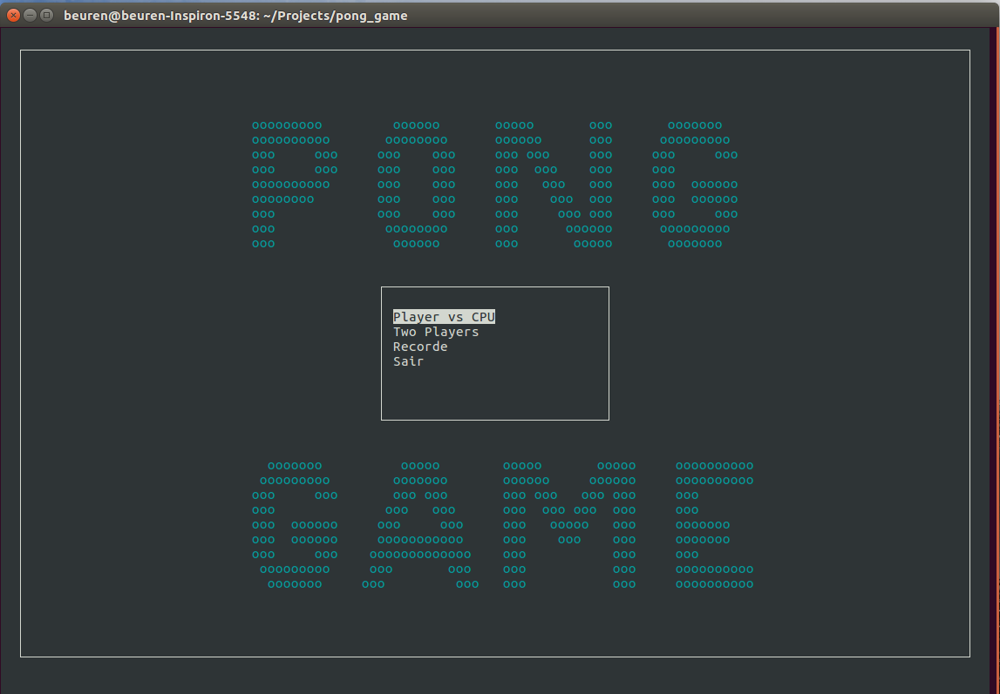
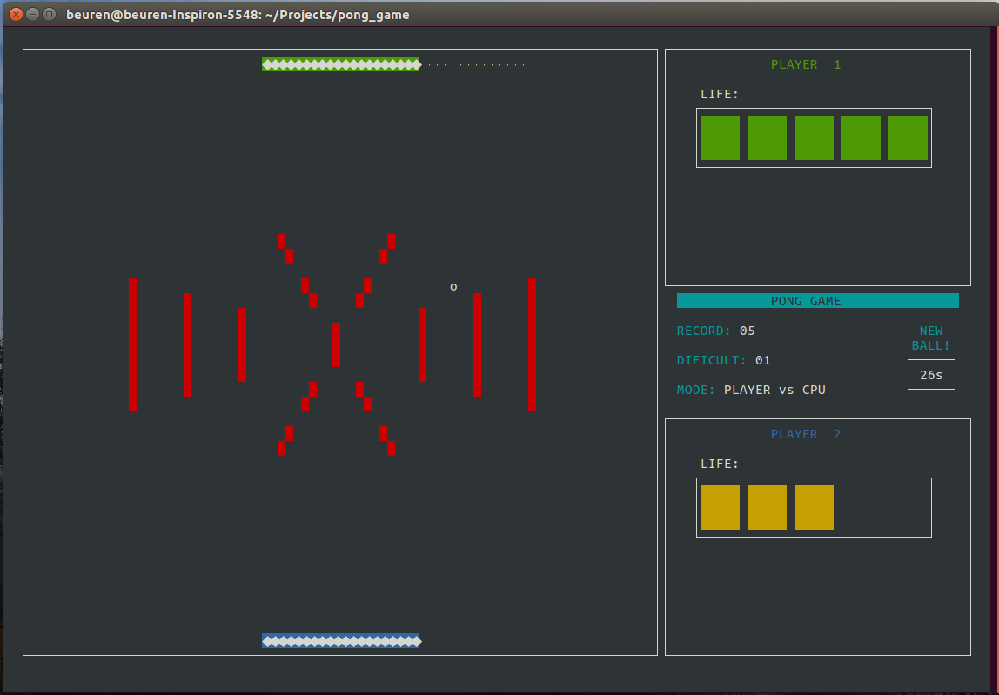
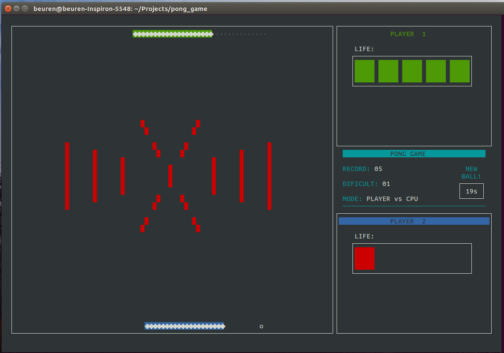
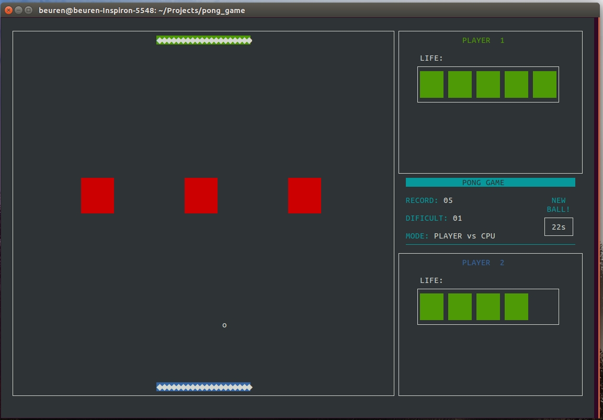

# INF01202 - Algoritmos e Programação

**Trabalho final - Pongball**

**Autores:** Béuren Bechlin e Lucas Leal

_Publicado sob licença GPL3.0_


### Requisitos

O jogo foi desenvolvido utilizando a biblioteca [ncurses](https://www.gnu.org/software/ncurses/) que basicamente extende funções gráficas e de controle de terminais Linux. Na realidade essa biblioteca emula uma outra biblioteca chamada _curses_ feita para BSD Unix. Logo, é necessário de uma implementação dessa biblioteca para o seu sistema.


### Compilação

Para facilitar na organização do código optamos por separar cada família de funções em um respectivo arquivo. No entanto, para compilar o código final é necessário ter cada um desses subprogramas já compilado. Para facilitar o processo decidimos utilizar um Makefile, usando a ferramenta make para gerar o executável em um simples passo.
Essa ferramenta funciona com regras e uma delas foi adicionada para instalar a biblioteca __ncurses__ usando a ferramenta [APT](https://www.gnu.org/software/ncurses/) disponível em distribuições baseadas em Debian GNU/Linux.

No diretório contendo os arquivos-fonte, basta executar:

```
$ make setup

```
Como essa regra instala um pacote no sistema é necessário ter permissões de super usuário. Após a __ncurses__ instalada é possível rodar a regra que compila todo o
projeto.

```
$ make

```

Serão gerados os arquivos objetos de todos subprogramas além do executável principal, chamado de pong.

### Execução

Para executar o jogo, basta executar o comando:

```
$ ./pong
```

### Como jogar


A partir do menu principal é possível escolher entre os dois modos de jogo:

* Player vs CPU
* Two Player

No modo de um jogador a raquete é controlada usando as setas direcionais e a tecla ESC volta ao menu incial. No modo multiplayer, a raquete inferior continua sendo controlado pelas setas direcionais mas a raquete superior é controlada pelas teclas 'A' e 'D'. Ainda no menu principal é possível abrir a janela do Recorde que mostra qual o maior nível já atingido e o nome do jogador que estava jogando.

### Imagens do Jogo





---
## Organização do código

Como mencionado anteriormente optamos por separar cada família de função em um programadiferente. O critério usado foi tentar agrupar em um mesmo arquivo todas funções relacionadas a um mesmo aspecto da jogo mas sem causar muita fragmentação do código, o que também pode dificultar a sua leitura.

### Base do projeto

Para desenvolvimento do problema optamos por realizar todas as operações em relação a um contador de tempo que denominamos millis, logo não introduzimos velocidades absolutas e sim tempo entre atualizações. Devido o processamento de várias coisas na execução plena do jogo o tempo de pausar do processador não pode ser exatamente 1000 microsegundos, então, é usado uma dinâmica com a função clock() para estimar o tempo perdidos na execução do trecho de código em milisegundos.

Todos os itens impressos em tela estão frames, utilizando uma lógica com frameBuffer onde todas as operações com objetos são realizados na tabela referente ao frame e esse frame por sua vez é totalmente impresso na tela. Optamos por imprimir todo o frame na tela em vez de somente o que foi atualizado já que a ncurses realiza esse tipo de operação quando é chamado wrefresh(), então não ganhariamos muito em processamento.

### Tópicos importantes

A verificação da colisão da bola com outros itens é realizada somente em 3 quadros ao redor dela, assumindo que ela estará sempre andando na diagonal é suficientes esses teste, claro que sempre ela deverá ser a primeira a ser interpretada antes mesmo de movimentação de paddles e etc.

Embora o frame do jogo e status pudessem ser tratados da mesma optamos por realizar sua atualização em funções diferentes, visto que o jogo é mais atualizado e frame contem mais tipos de caracteres possíveis percebemos que realizar um protocolo para os dois seria mais organizado mas menos eficiente para atualização do jogo (12 caracteres diferentes).

Outro ponto é a adição de um frame para cor no caso do stats, que, como citado anteriormente, poderia ser realizado em apenas um com um protocolo diferenciado, mas para debug isso seria extremamente ruim e o escolhido foi realizar da forma que é melhor interpretado visualmente. No arquivo das funções gráficas foi criado uma função para de debug que foi muito utilizada, onde é adicionada para um arquivo
a tabela de um frame.

Está sendo usado um gerador de números aleatórios diferente do padrão do C, que está implementado em um arquivo separado. Esse escolha se baseou no baixo range da gerador padrão e na sua não baixa confiabilidade, embora inicialmente pensavamos que iriamos usar muito mais o fator aleatório do que foi necessário.
Algoritmo escolhido foi ranmar pela já utilização em outras disciplinas.


### Descrição das estruturas

Nessa seção uma descrição de algumas estruturas utilizadas.

**COORD:** struct básica para coordenadas carteisanas
* COORD.x
* COORD.y

**BALL:** struct para as bolas do jogo
* BALL.position é a posição da bola na tela
* BALL.velocity é o sentido do movimento da bola
* BALL.enabled diz se a bola está ativa ou não (esse argumento é necessário pois precisavamos declarar todoas bolas no inicio do programa, mas elas ia entrar em jogo aos poucos)

**PADDLE:** struct para as raquetes
* PADDLE.position
* PADDLE.velocity são COORD tem papel similar ao atributos de BALL
* PADDLE.len é unsigned int e é o comprimento da raquete
* PADDLE.botMode é BOOL e diz se o PADDLE é controlado por humanos ou pelo CPU
* PADDLE.vertical é BOOL e diz se o PADDLE estará na vertical ou nas horizontais (os PADDLES na vertical foram um ideia que tivemos de um modo de jogo para até 4 jogadores, acabou não sendo implementado)
* PADDLE.advanceKey
* PADDLE.regressKey são int e são as teclas de movimento do PADDLE
* PADDLE.speel é int e é a taxa de atualização do PADDLE (ou a velocidade com que se move na tela)

**LEVEL:** struct com as informações de cada npivel do jogo
* LEVEL.map é char[][] e guarda os caracteres do mapa
* LEVEL.mapCode é char e é o numero do mapa usado para selecionar o arquivo de mapa
* LEVEL.dificult é int e é o nivel de dificuldade
* LEVEL.errorProb é float e é a chance do BOT fazer um movimento errado
* LEVEL.mode é int e é o tipo de jogo selecionado no menu inicial
* LEVEL.nPad é int e é o numero de PADDLES ativos
* LEVEL.nBall é int e é o numero de BALLS total
* LEVEL.newBallTime é int e é o tempo que levará para uma nova bola surgir
* LEVEL.newBallCurrentTime é int e é um contador até o tempo da nova bola
* LEVEL.p1Score
* LEVEL.p2Score são int e são os blocos de vida de cada PADDLE

**FRAME:** struct para controlar os frames usados no controles das colisões
* FRAME.src é char** e guarda a matriz de caracteres usados para controlar as colisões
* FRAME.width
* FRAME.height são int e são os limites do frame

**RECORD:** struct para salvar as informações do recorde
* RECORD.playerName é char[] e salva o nome do jogador
* RECORD.recordLevel é int e salva o maior nível alcançado
